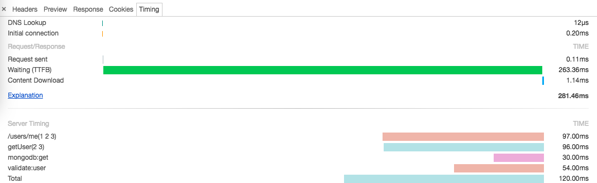

# supertiming

Get the function timing log

[](https://travis-ci.org/vicanso/supertiming)
[](https://coveralls.io/r/vicanso/supertiming?branch=master)
[](https://www.npmjs.org/package/supertiming)
[](https://github.com/vicanso/supertiming)

## Installation

```js
$ npm install supertiming
```

## API

### constructor

- `options.startIndex` The start index for server timing, default is 'A'
- `options.precision` The precision for time, `ms` or `ns`, default is 'ms'

```js
const Timing = require('supertiming');
const timing = new Timing({
  startIndex: '0',
  precision: 'ns',
})
```

### start

Set the starting point of timing function, if there is any function is not finished, it will be the child of those functions

- `name` The function name of timing


```js
const Timing = require('supertiming');
const delay = ms => new Promise(resolve => setTimeout(resolve, ms));
const timing = new Timing();
const endGetUser = timing.start('GetUserInfo');
delay(10).then(() => {
  timing.start('FindOneById:User');
}).then(() => {
  endGetUser();
});
```

### end

Set the ending point of timing function

- `name` The function name to timing, if the name is `*` or `null`, end all doing timing

```js
const Timing = require('supertiming');
const delay = ms => new Promise(resolve => setTimeout(resolve, ms));
const timing = new Timing();
timing.start('GetUserInfo');
delay(10).then(() => {
  timing.start('FindOneById:User');
  return delay(40);
}).then(() => {
  timing.end();
});
```

### addMetric

Add metric to timing

- `name` The function name of timing

- `use` Cost time of function

```js
const Timing = require('supertiming');
const timing = new Timing();
timing.addMetric('Get-Session', 35);
const data = timing.toJSON();
// [ { name: 'Get-Session', use: 35 } ]
console.info(data);
```

### remove

Remove the function from timing

- `name` The function name of timing

```js
const Timing = require('supertiming');
const delay = ms => new Promise(resolve => setTimeout(resolve, ms));
const timing = new Timing();
timing.start('GetUserInfo');
delay(10).then(() => {
  timing.start('FindOneById:User');
  return delay(40);
}).then(() => {
  timing.remove('FindOneById:User');
  // only timing `GetUserInfo`
  timing.end();
});
```

### rename

Change the function name of timing

- `name` The original function name

- `newName` The new function name

```js
const Timing = require('supertiming');
const delay = ms => new Promise(resolve => setTimeout(resolve, ms));
const timing = new Timing();
timing.start('GetUserInfo');
delay(10).then(() => {
  timing.start('FindOneById:User');
  return delay(40);
}).then(() => {
  timing.rename('FindOneById:User', 'FindOneByIdNew:User');
  timing.end();
});
```

### toJSON

Get tming json format

- `ignoreChildren` ignore the children, default is false

```js
const Timing = require('supertiming');
const delay = ms => new Promise(resolve => setTimeout(resolve, ms));
const timing = new Timing();
timing.start('/users/me');
const endGetUser = timing.start('getUser');
timing.start('mongodb:get')
delay(30)
  .then(() => {
    timing.end('mongodb:get');
    timing.start('validate:user');
    return delay(50);
  })
  .then(() => {
    timing.end('validate:user');
    return delay(10);
  })
  .then(() => {
    endGetUser();
    timing.end('/users/me');
    const data = timing.toJSON();
    //[ { name: '/users/me',
    //    startedAt: 1486736323078,
    //    use: 104,
    //    children: [ 'getUser', 'mongodb:get', 'validate:user' ] },
    //  { name: 'getUser',
    //    startedAt: 1486736323078,
    //    use: 104,
    //    children: [ 'mongodb:get', 'validate:user' ] },
    //  { name: 'mongodb:get', startedAt: 1486736323078, use: 37 },
    //  { name: 'validate:user', startedAt: 1486736323116, use: 53 } ]
    console.info(data);
  }).catch(console.error);
```

### toServerTiming

Get server timing for http response

- `ignoreChildren` ignore the children, default is false

```js
const Timing = require('supertiming');
const delay = ms => new Promise(resolve => setTimeout(resolve, ms));
const timing = new Timing();
timing.start('/users/me');
timing.start('getUser');
timing.start('mongodb:get')
delay(30)
  .then(() => {
    timing.end('mongodb:get');
    timing.start('validate:user');
    return delay(50);
  })
  .then(() => {
    timing.end('validate:user');
    return delay(10);
  })
  .then(() => {
    timing.end('getUser');
    timing.end('/users/me');
    const data = timing.toServerTiming();
    // A=0.097;"/users/me(1 2 3)",B=0.096;"getUser(2 3)",C=0.03;"mongodb:get",D=0.054;"validate:user"
    console.info(data);
  }).catch(console.error);
```

### setServerTimingStartIndex

Set the server timing start index, default is `A`

- `ch` The start index char

```js
const Timing = require('supertiming');
const delay = ms => new Promise(resolve => setTimeout(resolve, ms));
const timing = new Timing();
timing.setStartIndex('a');
timing.start('/users/me');
timing.start('getUser');
timing.start('mongodb:get')
delay(30)
  .then(() => {
    timing.end('mongodb:get');
    timing.start('validate:user');
    return delay(50);
  })
  .then(() => {
    timing.end('validate:user');
    return delay(10);
  })
  .then(() => {
    timing.end('getUser');
    timing.end('/users/me');
    const data = timing.toServerTiming();
    // a=0.097;"/users/me(1 2 3)",b=0.096;"getUser(2 3)",c=0.03;"mongodb:get",d=0.054;"validate:user"
    console.info(data);
  }).catch(console.error);
```

## Examples

Set `Server-Timing` useing `Koa2`

```js
const Timing = require('supertiming');
const Koa = require('koa');
const app = new Koa();

function getUser() {
  ...
}

function mongodbGet() {
  ...
}

function validateUser() {
  ...
}

app.use((ctx, next) => {
  const timing = new Timing();
  timing.start('Total');
  ctx.state.timing = timing;
  return next().then(() => {
    tming.end('*');
    ctx.set('Server-Timing', timing.toServerTiming());
  });
});

app.use((ctx) => {
  if (ctx.url === '/user/me') {
    const timing = ctx.state.timing;
    timing.start('/user/me');
    timing.start('getUser');
    return getUser()
      .then(() => {
        timing.start('mongodb:get');
        return mongodbGet();
      })
      .then(() => {
        timing.end('mongodb:get');
        timing.start('validate:user');
        return validateUser();
      })
      .then(() => {
        timing.end('validate:user');
        ctx.body = {
          account: 'vicanso',
        };
        timing.end('/user/me');
      });
  }
});

app.listen();
```



## License

MIT
